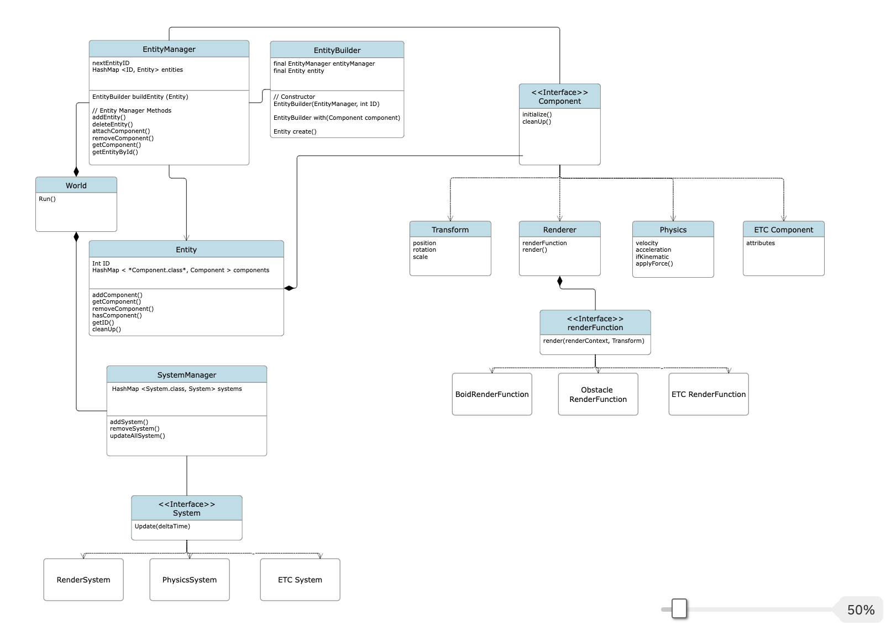

# BoidEngine
### *An ECS-Based Java Game Engine Abstraction Interface*
##### Developed By: **Daniel Hatakeyama**, **Ben Xiang**, **River Jordan**

---

## Description

<strong>*BoidEngine*</strong> is a high-level game engine abstraction built over Processing<sup><a href="#source1">[1]</a></sup> utilizing an advanced Entity Component System (ECS)<sup><a href="#source2">[2]</a></sup> for arbitrary virtual object interaction and behavior.

BoidEngine is not a full-stack implementation—it relies on Processing for graphics and is designed as a lightweight abstraction layer. Future enhancements (e.g., more support for user scripting, asset management, redesigned interface) are planned to further extend its capabilities.

## Key Features

- **Game Engine "Unity-like" abstraction:**  
  
  Efficiently manages diverse game objects via a comprehensive abstraction layer built on Processing, leveraging primitive batching optimizations for rendering performance. 

- **Robust ECS Architecture:**  
  Implements a modular ECS design inspired by industry standards, favoring **"Composition over inheritance"**.
  - **Entities:** Act as *"game objects"* in the scene, acting as attachment points for components.
  - **Components:** Hold modular data and state for entities, allowing for arbitrary configuration and behavior.
  - **Systems:** Process and govern behavior through a robust event-driven approach, ensuring scalable and maintainable game logic. 

- **Integrated Boid Simulation Demonstration:**  
  Features an interactive **boid simulation**<sup><a href="#source3">[3]</a></sup> that showcases the engine’s capabilities. The demo supports several thousand boids—with multiple clans that can be spawned via left, right, or middle mouse clicks.

- **Extensibility & Future Roadmap:**  
  Although currently focused on core game object and ECS functionality, BoidEngine is designed with extensibility in mind. Planned enhancements include integrating a consistent and easy-to-use user scripting interface, paving the way for a **future comprehensive game engine library built on top of Processing**.


## “Me and da Boids” 
**Video Demonstration:** *This interactive boid<sup><a href="#source3">[3]</a></sup> demonstration showcases the engine’s capabilities by using the ECS game engine to handle all objects, interactions, and behaviors for a flocking simulation.*

<!--
<div style="width: 720px; margin: 0 auto; text-align: center;">
  <video width="720" autoplay muted controls loop>
    <source src="resources/videos/boid_demo.mp4" type="video/mp4">
    Your browser does not support the video tag.
  </video>
  <p><strong>Video 1:</strong> Demonstration of multi-agent boid simulation implemented with ECS game engine.</p>
</div>
-->

[](https://www.youtube.com/watch?v=_Nx9rcltQ_I)

## Design Overview

### Project Structure
Below is the current repository layout. Each `.pde` file handles a distinct aspect of the ECS and is coupled with a brief description.

```
├── ProcessingMockup  
│    ├── BoidSystems.pde    // FUTURE: Implement formal script loader
│    ├── Component.pde      // Defines base component
│    ├── Entity.pde         // Defines base entity
│    ├── EntityBuilder.pde  // Builder for entity-component construction
│    ├── EntityManager.pde  // Entity Creation, Deletion, Handling
│    ├── EventManager.pde   // Decoupled event system
│    ├── Event.pde          // Defines base event
│    ├── ProcessingMockup.pde  // "Main"
│    ├── RenderFunction.pde // Base renderer and concrete extentions
│    ├── SystemManager.pde  // Manages and updates all systems
│    ├── Systems.pde        // Defines base system
│    └── ... (additional files as needed)  
├── resources 
├── report  
├── .gitignore  
├── LICENSE  
└── README.md 
```
<div align="center">
  <b>Fig 1:</b> Project layout with descriptions.
</div>

---

### UML Diagram


<div style="width: 806px; margin: 0 auto;">
  
  <div style="text-align: center; margin-top: 8px;">
    <strong>Fig 2:</strong> <code>resources/images/UML_Diagram_ECS_Boid_Engine.png</code>
  </div>
</div>

---

### Main Utilized Design Patterns

- **Entity Component System (ECS) Architecture** – Separates data (components) from functionality (systems) to keep entities lightweight.
- **Builder Pattern** – Easily assemble complex entities using the `EntityBuilder` class.
- **Event-Driven Architecture** – Facilitates loose coupling between components and system logic.
- **Strategy Pattern** – Used in rendering, providing multiple render strategies for different entity types.
- **Composition** – Components attach to entities, avoiding deep inheritance hierarchies.
- **Dependency Injection** – Decouples object creation from usage by injecting required dependencies into components at runtime, enhancing modularity, flexibility, and testability.

## Running the Engine

### Requirements
- Processing 4.x  
- Java Runtime Environment (JRE) 8 or higher  
<br>
---

<div style="display: flex; align-items: center;">
  <a href="https://processing.org">
    <svg width="90" style="height: auto;" viewBox="0 0 800 800" fill="none"><path d="M400 500C700 500 700 100 400 100" stroke="#0468FF" stroke-width="150"></path><path d="M400 200L100 600" stroke="#1F34AB" stroke-width="150"></path><path d="M100 300L200 500" stroke="#85AEFF" stroke-width="150"></path></svg>
  </a>
  <div style="font-size: small; margin-left: 1em;">
    <strong>Processing</strong><sup><a href="#source1">[1]</a></sup> is an open-source software environment and programming language built on Java, designed primarily for visual and interactive projects. It’s widely used by artists, designers, and hobbyists to quickly prototype animations, generative art, data visualizations, and user interface experiments. By providing a simplified API and an intuitive IDE, Processing makes it easy to learn and apply creative coding techniques.
  </div>
</div>

---
### Installation
1. Install [Processing 4](https://processing.org/download).
2. Clone or download this repository to your local machine.
3. Ensure the `ProcessingMockup` directory structure remains intact.

### Method 1: Using Processing IDE
1. Open Processing.
2. Select **File > Open**.
3. Choose **ProcessingMockup.pde** from the `ProcessingMockup` folder.
4. Click **Run** or press **Ctrl/Cmd + R**.

### Method 2: Command Line
Use the Processing command line tool `processing-java` to run the program:

#### Windows:
```bash
"C:\Program Files\processing-4.x\processing-java" --sketch="%USERPROFILE%\path\to\repo\ProcessingMockup" --run
```

#### macOS / Linux:
```bash
processing-java --sketch="$HOME/path/to/repo/ProcessingMockup" --run
```

## License
This project is licensed under the Mozilla Public License. See the [LICENSE](LICENSE) file for details.

## Questions or Feedback?
Feel free to reach out or open an issue! Contributions and suggestions are welcome.

## Sources
1. <a id="source1"></a> [Processing Main Website](https://processing.org/) - Download, View documentation,  and explore Processing.
2. <a id="source2"></a> [Entity Componenent System](https://en.wikipedia.org/wiki/Entity_component_system) - ECS Wikipedia Overview.
3. <a id="source3"></a> [Boid Flocking Simulation Wikipedia](https://en.wikipedia.org/wiki/Boids) - Boids Wikipedia Overview.
4. <a id="source4"></a> [Sebastian Lague Boid Demonstration](https://www.youtube.com/watch?v=bqtqltqcQhw) - Inspiration for the project